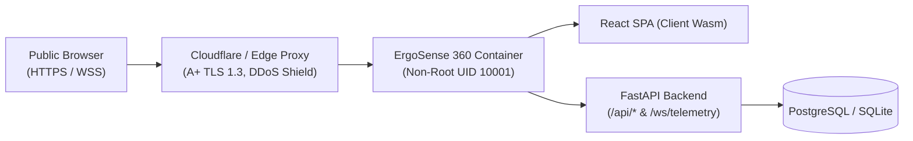

# Production Deployment Guide — ErgoSense 360

This guide provides three production-grade, zero-trust deployment options to safely host **ErgoSense 360** for end users.

> [!IMPORTANT]
> **HTTPS / SSL is strictly required for public webcam applications.**
> Modern web browsers (`Chrome`, `Edge`, `Safari`, `Firefox`) automatically block camera stream access (`navigator.mediaDevices.getUserMedia`) on unencrypted HTTP connections outside of `localhost`. All options below provision automated SSL/TLS certificates.

---

## Deployment Options Matrix

| Method | Target Platform | Setup Time | Cost | SSL Certificate | WebSockets | Recommended For |
| :--- | :--- | :--- | :--- | :--- | :--- | :--- |
| **Option A (Recommended)** | **Render.com** | ~3 minutes | Free tier available | Automated Let's Encrypt | Native WSS | Instant 1-click cloud launch from GitHub |
| **Option B** | **Railway.app / Fly.io** | ~3 minutes | Free / Low usage | Automated TLS | Native WSS | Fast edge deployment |
| **Option C** | **Hardened VPS (Ubuntu + Docker Compose)** | ~15 minutes | $4–$10/mo | Let's Encrypt / Cloudflare | Nginx proxy | Enterprise self-hosted & compliance control |

---

## Option A: 1-Click Cloud Deployment via Render.com (Recommended)

Render provides native Docker container hosting with automated HTTPS, zero-config WebSockets, and continuous deployment directly from your GitHub repository.

### Step 1: Sign in to Render
1. Visit [render.com](https://render.com) and sign in using your **GitHub account**.

### Step 2: Create a Web Service
1. Click **New +** $\rightarrow$ **Web Service** (or **Blueprint**).
2. Connect your repository: **`sp5900638-max/ErgoVision`**.
3. Render will automatically detect the root `Dockerfile` and `render.yaml`.
4. Configure service settings:
   - **Name**: `ergosense-360`
   - **Region**: Choose closest to your users (e.g., `Oregon`, `Frankfurt`, `Singapore`)
   - **Branch**: `main`
   - **Runtime**: `Docker`
   - **Instance Type**: `Free` (or `Starter` for dedicated performance)
5. Under **Environment Variables**, verify:
   ```env
   ALLOWED_ORIGINS=*
   ENVIRONMENT=production
   ```
6. Click **Create Web Service**.

### Step 3: Verification
Render will build the multi-stage Docker container (React SPA + FastAPI backend) and assign a secure URL:
```
https://ergosense-360.onrender.com
```
- Open the URL in your browser.
- Allow camera permissions $\rightarrow$ Posture tracking, RULA gauge, and telemetry stream work immediately!

---

## Option B: Deploying to Railway.app

1. Navigate to [railway.app](https://railway.app) and log in with GitHub.
2. Click **New Project** $\rightarrow$ **Deploy from GitHub repo**.
3. Select **`sp5900638-max/ErgoVision`**.
4. Railway will automatically detect the root `Dockerfile` and `railway.json`.
5. Under **Settings** $\rightarrow$ **Networking**, click **Generate Domain**.
6. Railway assigns a secure HTTPS domain (e.g., `https://ergovision-production.up.railway.app`).

---

## Option C: Self-Hosted Production VPS (Ubuntu 24.04 LTS + Docker Compose)

For complete infrastructure ownership, deploy using our multi-container zero-trust architecture.

### Step 1: Prepare Server & Apply OS Hardening
SSH into your clean Ubuntu 24.04 LTS instance and execute the automated hardening script:
```bash
git clone https://github.com/sp5900638-max/ErgoVision.git /opt/ergosense
cd /opt/ergosense
sudo bash scripts/harden-host.sh
```
*Applies UFW firewall rules, non-root deployer user, SSH hardening, fail2ban, and kernel network sysctl hardening.*

### Step 2: Configure Environment Variables
```bash
cp .env.example .env.prod
chmod 600 .env.prod
```
Generate secure random passwords:
```bash
openssl rand -hex 32
```
Edit `.env.prod`:
```env
POSTGRES_DB=ergosense_prod
POSTGRES_USER=ergo_admin
POSTGRES_PASSWORD=<SECURE_GENERATED_PASSWORD>
REDIS_PASSWORD=<SECURE_GENERATED_PASSWORD>
DATABASE_URL=postgresql://ergo_admin:<SECURE_GENERATED_PASSWORD>@postgres:5432/ergosense_prod
REDIS_URL=redis://:<SECURE_GENERATED_PASSWORD>@redis:6379/0
ALLOWED_ORIGINS=https://ergosense.yourdomain.com
DOMAIN_NAME=ergosense.yourdomain.com
```

### Step 3: Launch Containers
```bash
docker compose -f docker-compose.prod.yml up -d --build
```

### Step 4: Verify Deployment & Attack-Surface
Execute the security verification script:
```bash
bash scripts/verify-security.sh https://ergosense.yourdomain.com
```
*Verifies non-root execution, internal port isolation (Postgres/Redis ports blocked from internet), enterprise headers, scanner blocking, and rate limiting.*

---

## Zero-Trust Architecture Summary



- **Zero Video Telemetry**: 100% of camera inference occurs client-side in the user's browser using MediaPipe Wasm/WebGPU. No video frames ever reach the server.
- **Minimal Surface**: Only ports 80/443 are exposed at the edge. Internal databases have zero public port bindings.
- **Strict Headers**: HSTS, CSP, COOP (`same-origin`), and COEP (`require-corp`) enabled for WebAssembly security.
