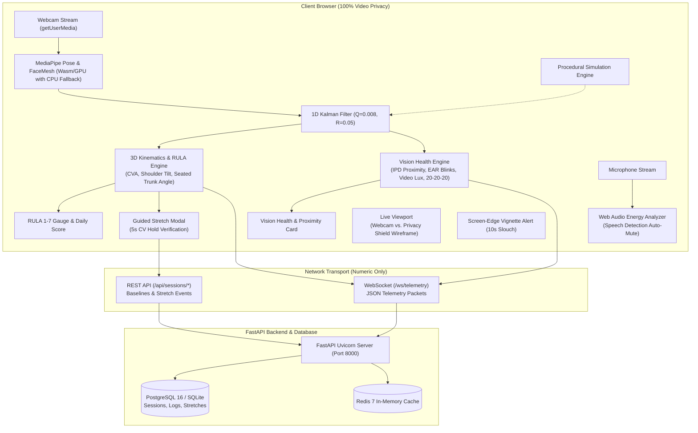

# ErgoSense 360 — Real-Time Ergonomic & Vision Health Platform

[](https://opensource.org/licenses/MIT)
[](https://fastapi.tiangolo.com)
[](https://react.dev)
[](https://www.docker.com)
[](https://owasp.org)

**ErgoSense 360** is an enterprise-grade, real-time biomechanical ergonomic and vision-health monitoring platform. It combines **complete client-side camera stream privacy** (zero video frames transmitted across the network) with **in-browser WebAssembly/WebGPU MediaPipe computer vision**, **automated GPU-to-CPU hardware fallback**, **1D Kalman coordinate filtering**, **3D kinematics & RULA assessment**, **vision proximity & blink health tracking**, **speech detection auto-mute**, **guided micro-break stretches with 5-second CV hold verification**, an interactive **Simulation Mode**, and a hardened **FastAPI + PostgreSQL / SQLite backend**.

---

## Architecture Overview



---

## Core Functional Engines & Reliability Upgrades

### 1. In-Browser Client Inference & Privacy
- **Zero Video Stream Transmission**: Raw video frames are processed exclusively inside the browser using `@mediapipe/tasks-vision` running via WebAssembly. Video never traverses the network.
- **Asynchronous Model Synchronization**: Inference queue automatically starts the animation loop as soon as neural network weights finish downloading, eliminating race conditions when monitoring starts early.
- **Automated GPU-to-CPU Fallback**: Gracefully detects WebGL context loss or lack of hardware acceleration and falls back to CPU execution, preventing application crashes.
- **Seated Desk Ergonomics Tolerance**: Accurately tracks head posture and shoulder tilt even when hips are outside the webcam frame during normal desk seating.
- **Pixel-Perfect Canvas Overlay**: Dynamically synchronizes canvas coordinates with the webcam stream's native resolution and aspect ratio (4:3 or 16:9), ensuring 1:1 skeleton alignment.
- **Simulation Mode**: Built-in procedural posture generator allows full interactive testing of RULA scoring, slouch alarms, stretch interventions, and reports even on devices without a physical camera.
- **Privacy Shield Mode**: Instant toggle between normal camera feed and a pure black canvas (`#070b14`) rendering ONLY the glowing, smoothed skeleton wireframe color-coded by RULA status.
- **1D Kalman Filtering**: Coordinates of ears, shoulders, nose, hips, and pupils pass through state-space `KalmanFilter1D` ($Q=0.008, R=0.05$) to eliminate coordinate jitter without introducing lag.

### 2. 3D Kinematics & RULA Evaluator
- **Craniovertebral Angle (CVA)**: True 3D spatial angle between the horizontal line through C7 (mid-shoulder) and the line connecting C7 to ear tragus. Upright neutral: $50^\circ - 55^\circ$; forward head slouch: $< 48^\circ$ (severe $< 40^\circ$).
- **Lateral Shoulder Tilt**: Angle of shoulder axis with the horizontal plane ($< 4.5^\circ$ level; $> 9^\circ$ asymmetrical).
- **Spine Trunk Angle**: Inclination of mid-shoulder to mid-hip vector with vertical $(0, -1, 0)$ ($< 11^\circ$ upright; $> 18^\circ$ slouched).
- **RULA Score (1–7 Scale)**:
  - **1–2 (Acceptable - Emerald)**: Optimal posture maintained.
  - **3–4 (Investigate - Amber)**: Mild forward head tilt or shoulder imbalance.
  - **5–6 (Change Soon - Orange)**: Pronounced posture fatigue.
  - **7 (Immediate Action - Rose)**: Severe ergonomic strain.

### 3. Vision Health & Proximity Engine
- **Inter-Pupillary Distance (IPD) Proximity Tracking**: Computes $IPD / IPD_0$. Warns user when ratio $> 1.25$ (viewing distance $< 45\text{cm}$).
- **Eye Aspect Ratio (EAR) Blink Monitor**: Evaluates eyelid opening ratio. Rolling 60s window calculates blinks/min (normal 14–22; $< 10$ alerts for digital eye strain).
- **Ambient Room Luminance**: Samples webcam video frames via a lightweight offscreen buffer ($Y = 0.299R + 0.587G + 0.114B$) to detect low lighting ($< 45$) or screen glare ($> 215$).
- **20-20-20 Rule Timer**: 20-minute countdown with rest reminders to look at an object 20 feet away for 20 seconds.

### 4. Audio Intelligence (Call & Speech Auto-Mute)
- Analyzes microphone RMS energy using the Web Audio API (`AudioContext` + `createAnalyser`).
- When speech energy exceeds threshold (e.g. user is on a call or speaking), `userSpeaking` automatically suppresses audio alert chimes, eliminating interruptions.

### 5. Guided Micro-Break Stretches with CV Hold Verification
- Auto-launches upon 3 consecutive poor posture events (or via HUD button).
- Exercises: **Cervical Spine Chin Tuck** (CVA $\ge 54^\circ$) and **Scapular Shoulder Retraction** (level shoulders & chest open).
- Requires **5 consecutive seconds of verified CV hold** with an interactive SVG progress ring. Logs completed interventions to backend database.

---

## Quickstart (Local Development)

### Prerequisites
- Python 3.10+ (tested on Python 3.12)
- Node.js 18+ (tested on Node v20/24)
- A working webcam (or use built-in **Simulation Mode**)

### Option A: One-Click Runner (Windows)
Double-click **`run.bat`** (or **`start.bat`**) in the repository root. It ensures the frontend bundle is built, starts the unified server, and automatically opens `http://localhost:8000` in your default browser.

### Option B: Command Line (Unified Server)
```bash
# 1. Install backend dependencies
python -m venv .venv
source .venv/bin/activate  # On Windows: .\.venv\Scripts\Activate.ps1
pip install -r backend/requirements.txt

# 2. Build frontend production assets
cd frontend
npm ci
npm run build
cd ..

# 3. Launch unified server
python -m uvicorn backend.app.main:app --host 0.0.0.0 --port 8000
```
Open **`http://localhost:8000`** in your browser.

---

## 🚀 Cloud Deployment for End Users

To deploy **ErgoSense 360** publicly so users can access it safely over HTTPS with camera permissions and WebSockets enabled, choose one of the following turnkey options (see full guide in [DEPLOYMENT.md](DEPLOYMENT.md)):

| Platform | Type | SSL | Setup Guide |
| :--- | :--- | :--- | :--- |
| **Render.com** (Recommended) | Managed PaaS / Docker | Free Auto-TLS | Connect GitHub repo & choose `render.yaml` blueprint |
| **Railway.app** | PaaS / Docker | Free Auto-TLS | Deploy from GitHub repo using `railway.json` |
| **Fly.io** | Global Edge Containers | Free Auto-TLS | Run `fly launch` using `fly.toml` |
| **Hardened VPS** | Self-Hosted Linux VPS | Let's Encrypt / Cloudflare | Run `scripts/harden-host.sh` & `docker compose` |

---

## Production Deployment & Zero-Trust Security Hardening Guide

### 1. Architecture & Network Micro-Segmentation

The production architecture enforces strict micro-segmentation across two isolated Docker bridge networks:
- **`edge_net` (Public DMZ)**: Connects Nginx reverse proxy to the application backend and static frontend.
- **`backend_net` (Internal-Only Bridge)**: Connects FastAPI backend to PostgreSQL 16 and Redis 7. **Database and cache have ZERO host port bindings** (`0.0.0.0` or `127.0.0.1`).

### 2. Containerization & Least-Privilege Execution
- **Multi-Stage Builds**: Build tools (`gcc`, `build-essential`, `libpq-dev`, `npm`) are stripped from runtime images.
- **Non-Root Execution**: Backend runs as `appuser:appgroup` (`UID 10001`), and frontend runs on unprivileged Nginx (`UID 101`).
- **Capability Dropping**: Containers enforce `cap_drop: [ALL]` and `security_opt: [no-new-privileges:true]`.
- **Read-Only Root Filesystem**: Root filesystems are mounted read-only with controlled `tmpfs` mounts for `/tmp`.

### 3. Orchestration Configuration (`docker-compose.prod.yml`)
Run the entire production stack with resource limits, health checks, and automatic restart:

```bash
# 1. Prepare environment configuration
cp .env.example .env.prod
chmod 600 .env.prod
# Edit .env.prod with secure passwords (openssl rand -hex 32)

# 2. Deploy with Docker Compose
docker compose -f docker-compose.prod.yml up -d --build
```

### 4. Edge Reverse Proxy & Hardening (`nginx/`)
- **A+ SSL/TLS**: TLS 1.2 and 1.3 only, modern cipher suites, session tickets disabled, OCSP stapling.
- **Enterprise Security Headers**:
  - `Strict-Transport-Security: max-age=63072000; includeSubDomains; preload`
  - `X-Frame-Options: DENY`
  - `X-Content-Type-Options: nosniff`
  - `Referrer-Policy: strict-origin-when-cross-origin`
  - `Cross-Origin-Opener-Policy: same-origin` & `Cross-Origin-Embedder-Policy: require-corp` (required for WebAssembly/WebGPU)
  - `Content-Security-Policy` with Wasm evaluation support
- **Rate Limiting**:
  - Global API: 30 req/s with burst allowance.
  - Sensitive Auth / Session Endpoints (`/api/sessions/start`, `/api/calibrate`): 5 req/min strict limit.
- **Vulnerability Scanner Blocking**: Automatically blocks `sqlmap`, `nikto`, `masscan`, `gobuster`, and hidden dotfile access (`/\.(?!well-known).*`).

### 5. Automated Host & OS Hardening (Ubuntu 24.04 LTS VPS)
Execute the automated hardening script on your VPS:
```bash
sudo bash scripts/harden-host.sh
```
**Hardening Actions Applied:**
1. Provisions unprivileged `deployer` user with SSH key authentication.
2. Hardens SSH (`PermitRootLogin no`, `PasswordAuthentication no`, `MaxAuthTries 3`).
3. Prevents Docker from bypassing UFW via `/etc/docker/daemon.json`.
4. Configures UFW firewall (default deny incoming, rate-limited SSH, HTTP 80, HTTPS 443).
5. Sets up `fail2ban` for SSH and Nginx rate-limit violations.
6. Enables automatic zero-day security patching via `unattended-upgrades`.
7. Hardens Linux kernel network stack via sysctl (ASLR, SYN flood protection, anti-spoofing reverse path filtering).

### 6. Security Verification & Attack-Surface Audit
Verify your deployment using the automated audit script:
```bash
bash scripts/verify-security.sh https://ergosense.yourdomain.com
```

**Audit Checklist Verified:**
- [x] Host port scan confirms ports 5432 (Postgres) and 6379 (Redis) are NOT exposed to the host or internet.
- [x] Containers execute under non-root UIDs (`10001` and `101`).
- [x] All 7 Enterprise Security Headers present on HTTP responses.
- [x] Simulated vulnerability scanner user-agents (`sqlmap`) blocked with HTTP 403 Forbidden.
- [x] Rate limiting triggers HTTP 429 Too Many Requests upon rapid bursts.

---

## Automated Test Suite

Run the full pytest suite covering 3D kinematics, RULA evaluation, session persistence, and API endpoints:
```bash
python -m pytest backend/tests/ -v
```
All **17 tests pass** across:
- `test_health_check`
- `test_calibrate_endpoint`
- `test_reset_session_endpoint`
- `test_tracker_configuration`
- `test_tracker_confidence_filtering`
- `test_evaluator_low_confidence_ignored`
- `test_evaluator_alert_grace_window`
- `test_evaluator_angled_view_support`
- `test_websocket_stream`
- `test_serve_spa_root`
- `test_session_lifecycle`
- `test_cva_upright_posture`
- `test_cva_forward_head_slouch`
- `test_shoulder_tilt`
- `test_trunk_angle`
- `test_rula_score_mapping`
- `test_ipd_proximity_alert`

---

## License

This project is licensed under the MIT License - see the [LICENSE](LICENSE) file for details.
